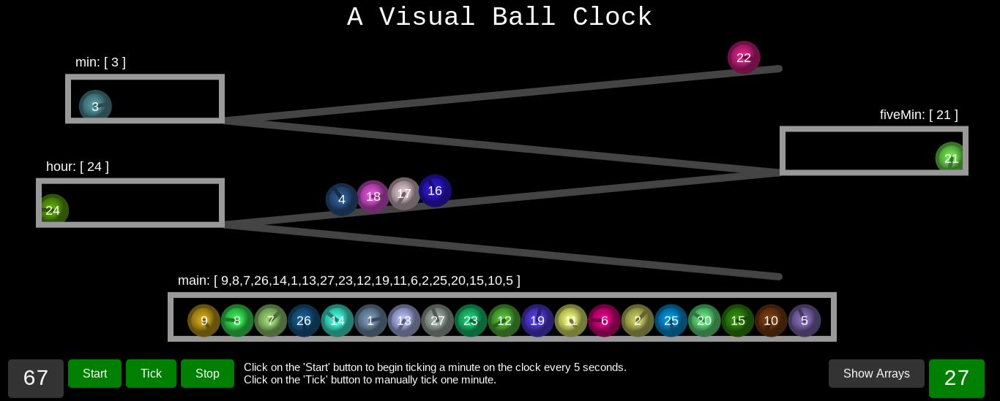

# Ball Clock

_This represents both a visual and an algorithmic simulation of a ball clock using vanilla Javascript._

### What exactly is a ball clock?

A ball clock is a mechanical device capable of telling time. It consists of a collection of ball bearings that run on different tracks and collect in different bins to demonstrate hours, five-minute increments, and minutes. 

Once each minute, a lever lifts a ball bearing from a collection of balls (`main`) to the top of a track. It rolls down the track into the first bin (`min`), which counts minutes. Once this bin receives its fifth ball, it empties. The four original balls roll down in reverse order to the original bin (`main`), and the fifth ball rolls onto the next track and down into the next bin (`fiveMin`).

Eventually, the five-minute bin (`fiveMin`) fills up with eleven balls, and when the twelfth ball approaches, it triggers the bin to empty, sending the original eleven balls in reverse order back to the main bin (`main`) and the final ball into the third bin (`hour`), which keeps track of how many hours have passed since the beginning of the clock. The cycle continues until after twelve hours, the third bin (`hour`) empties, and all the original eleven balls return to the main bin (`main`) in reverse order, followed by the final ball.

By presenting the number of balls in each bin, the clock can demonstrate the current time.

For example, an output of the following...

```
min: 2 balls
fiveMin: 4 balls
hour: 8 balls
```

...demonstrates a time of `8:22`.

_(That's taking `0:00` as midnight/noon ... or it's `9:32` if there is a stationary ball in the `hour` bin to allow time to count from `1:00` to `12:00`.)_

### So... how does one implement a ball clock?

Well, first one needs to understand the complexities of exactly how the balls move around, and to do that, it helps to see it visually. More on that below...

Another thing that makes a ball clock interesting is the question of _which_ balls are in a given bin. Given a specific set of balls interated into a specific order, is it possible to tell longer increments of time since the clock's beginning?

If each of the ball are given a number, how does this add specificity and complexity to the problem? How do the number of balls initially loaded into the clock (in the `main` bin) impact this specificity?

For example, after iterating `27` balls for eight hours and twenty-two minutes (`502` minutes total), this is the state of the clock's bins:

```
min: [23, 13]
fiveMin: [18, 14, 20, 5]
hour: [24, 15, 7, 17, 22, 27, 1, 25]
main: [11, 21, 2, 4, 19, 9, 26, 10, 3, 6, 12, 8, 16]
```

And the ultimate question: for a given number of balls, how many twelve-hour cycles does it take for the balls to finally return to their original numerical order?


### An implementation of the clock could run in two modes.

#### **MODE 1:** Run the ball clock with a specific number of balls for a specified number of minutes.
```
ballClock.run(27, 502) // returns state
```
And receive an output of the current state.

#### **MODE 2:** Compute the number of days it will take a specified number of balls to return to their original state.
```
ballClock.run(27) // returns days
```
And receive an output in days.

A description of the task can be found [here](instructions.md).


### The Straightforward Algorithm

For an implementation of the straightforward algorithm of a ball clock in Javascript, check out [this code sandbox](https://repl.it/@jestann/ball-clock). The code can also be found in [ballClock.js](ballClock.js).

The straightforward algorithm simply iterates through the states of the clock, one minute at a time.

It runs pretty fast nonetheless. Here's some initial test output.

```
---------Test 1: it runs mode one correctly----------
30 balls were cycled over 325 minutes.
{"min":[],"fiveMin":[22,13,25,3,7],"hour":[6,12,17,4,15],"main":[11,5,26,18,2,30,19,8,24,10,29,20,16,21,28,1,23,14,27,9]}
Completed in 0 milliseconds (0 seconds)
Test 1 passed.
```
```
---------Test 2: it runs mode two correctly----------
30 balls cycle after 15 days.
Completed in 23 milliseconds (0.023 seconds)
45 balls cycle after 378 days.
Completed in 74 milliseconds (0.074 seconds)
Test 2 passed.
```
```
---------Test 3: it returns an error for invalid input----------
ERROR: MUST CHOOSE NUMBER OF BALLS BETWEEN 27 AND 127
Test 3 passed.
ALL TESTS PASS.
```
```
30 balls were cycled over 1000000 minutes.
{"min":[],"fiveMin":[23,19,30,1,28,21,13,7],"hour":[20,15,22,24,4,9,14,8,11,12],"main":[6,5,29,16,10,25,3,26,17,2,27,18]}
Completed in 91 milliseconds (0.091 seconds)
```
```
127 balls cycle after 2415 days.
Completed in 855 milliseconds (0.855 seconds)
```

### The Map Transformation Algorithm

For an implementation of a map transformation algorithm, check out [this code sandbox](https://repl.it/@jestann/ball-clock-2). The code can also be found in [ballClock2.js](ballClock2.js).

The map transformation algorithm relies on the fact that a complete rotation of a specified number of balls from original order back around to original order again will be a series of applications of the transformation from `0` hours to `12` hours. Once that transformation is calculated, it can be applied successively over and over until the original order is achieved, greatly reducing the number of iterations.

The number of days required will be equal to half the number of transformations applied to complete a full rotation.

The output for some initial testing returns the following. _(**Note:** Test 1 and the output for any Mode 1 calculation still uses the straightforward algorithm ... which doesn't seem to matter, as evidenced by the times below.)_ It's significantly faster than the original ... which was still so fast I barely noticed it.

```
---------Test 1: it runs mode one correctly----------
30 balls were cycled over 325 minutes.
{"min":[],"fiveMin":[22,13,25,3,7],"hour":[6,12,17,4,15],"main":[11,5,26,18,2,30,19,8,24,10,29,20,16,21,28,1,23,14,27,9]}
Completed in 1 milliseconds (0.001 seconds)
Test 1 passed.
```
```
---------Test 2: it runs mode two correctly----------
30 balls cycle after 15 days.
Completed in 1 milliseconds (0.001 seconds)
45 balls cycle after 378 days.
Completed in 4 milliseconds (0.004 seconds)
Test 2 passed.
```
```
---------Test 3: it returns an error for invalid input----------
ERROR: MUST CHOOSE NUMBER OF BALLS BETWEEN 27 AND 127
Test 3 passed.
ALL TESTS PASS.
```
```
30 balls were cycled over 1000000 minutes.
{"min":[],"fiveMin":[23,19,30,1,28,21,13,7],"hour":[20,15,22,24,4,9,14,8,11,12],"main":[6,5,29,16,10,25,3,26,17,2,27,18]}
Completed in 86 milliseconds (0.086 seconds)
```
```
127 balls cycle after 2415 days.
Completed in 39 milliseconds (0.039 seconds)
```


### The LCM Algorithm

It isn't a far step to realize that the number of transformations applied will be a collection of individual transformations on specific ball-number-slots. For instance, ball 1 may move to slot 8 and then to slot 10 and then back around to slot 8. The number of steps it takes for each ball-number-slot to complete a full rotation gives insight into how many steps it takes for the entire set of all ball-number-slots to complete a full rotation.

If the individual ball-number-slot steps are calculated, one can find the least common multiple of all these numbers of steps to find the number of steps required for the full set of balls to rotate. This will reduce the number of iterations required down to only the initial map transformation.

I'm not yet finished with an implementation of this algorithm, but eventually it will be [here](https://repl.it/@jestann/ball-clock-3).


### But in the end ... I kinda just want to _see_ it.

Drum roll please ... for the visualization.

So ... since Javascript is used for a lot more than just data structures and computations, I decided to add a little HTML and CSS and build a visual simulation of a ball clock. It's not entirely perfect, but it's an old-school video game rainbow, and that's what matters.

You can find the **[visual simulation of a ball clock here](https://codepen.io/jestann/full/mXprEd/)**.




